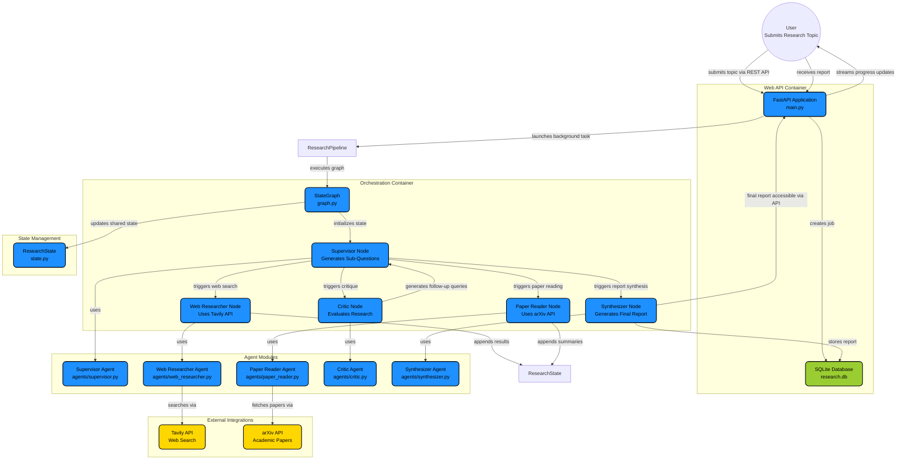

# 🔬 Multi-Agent Research Assistant

A multi-agent AI system that autonomously researches any topic using web search, academic papers, and LLM-powered synthesis — all orchestrated by [LangGraph](https://github.com/langchain-ai/langgraph).


---

## Architecture

**Quick mode** (`⚡`) skips the Critic and goes straight to the Synthesizer.

---

## Tech Stack

| Layer      | Technology                         |
| ---------- | ---------------------------------- |
| Backend    | Python, FastAPI, LangGraph         |
| Resilience | Tenacity (retries), SlowAPI (rate limits) |
| Testing    | Pytest, Pytest-Asyncio             |
| LLMs       | Groq (Llama 3.3 70B via free tier) |
| Web Search | Tavily API (free tier)             |
| Papers     | ArXiv API + PyMuPDF                |
| Frontend   | Vanilla HTML + CSS + SSE           |
| Storage    | SQLite                             |

---

## Features & Resilience

- **Relevant Academic Research:** Strict semantic and arXiv-category filtering prevents irrelevant papers (like astronomy or computer vision) from polluting LLM reports.
- **Auto-Retries:** Transient failures with Groq, Tavily, or ArXiv APIs are automatically retried via `tenacity` with exponential backoff.
- **Security & Scale:** Built-in `slowapi` rate limiting (10 req/min/IP), strict maximum concurrency constraints, and user input sanitization to stop prompt injections.
- **Robust Orchestration:** LangGraph state machine ensures data is properly passed through `supervisor → web_researcher → paper_reader → critic → synthesizer` loops, intelligently determining if a topic needs deeper follow-up research. 

---

## Setup

### 1. Clone & enter the project

```bash
git clone <repo-url>
cd multiagent-research
```

### 2. Create a virtual environment

```bash
python3 -m venv venv
source venv/bin/activate
```

### 3. Install dependencies

```bash
pip install -r requirements.txt
```

### 4. Configure API keys

```bash
cp .env.example .env
```

Edit `.env` and add your keys:

| Key              | Where to get it                                         |
| ---------------- | ------------------------------------------------------- |
| `GROQ_API_KEY`   | [console.groq.com](https://console.groq.com) → API Keys |
| `TAVILY_API_KEY` | [tavily.com](https://tavily.com) → Dashboard → API Keys |

### 5. Run

```bash
uvicorn main:app --reload --port 8000
```

Open **http://localhost:8000** in your browser.

---

## API Endpoints

| Method | Endpoint                    | Description                        |
| ------ | --------------------------- | ---------------------------------- |
| POST   | `/research`                 | Start a research job               |
| GET    | `/research/{job_id}/stream` | SSE event stream for live progress |
| GET    | `/research/{job_id}/report` | Retrieve completed report          |
| POST   | `/research/{job_id}/export` | Download report as `.md` file      |

---

## v2 Roadmap

- [ ] Parallel agent execution via LangGraph `Send` API
- [ ] Vector store caching for previously researched topics
- [ ] Citation quality scoring
- [ ] User-configurable agent parameters
- [ ] Docker deployment
