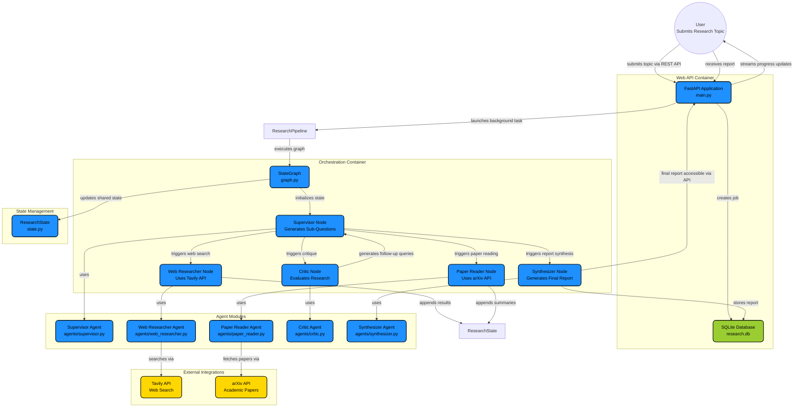

# Multi-Agent Research Assistant

A multi-agent AI system that autonomously researches any topic by searching the web, reading academic papers, critiquing results, and synthesizing a structured markdown report — orchestrated by [LangGraph](https://github.com/langchain-ai/langgraph).


---

## Architecture



**Quick mode** (`⚡`) skips the Critic and goes straight to the Synthesizer.

---

## How It Works

The pipeline operates as a **LangGraph StateGraph** where all agents read from and write to a shared `ResearchState` (defined in `state.py`).

1. **Supervisor** (`agents/supervisor.py`) — Receives the topic and uses the Groq LLM to generate 3–5 targeted sub-questions (5 for Deep mode, 3 for Quick). On loop re-entry, it generates follow-up questions based on gaps identified by the Critic.
2. **Web Researcher** (`agents/web_researcher.py`) — Iterates over sub-questions and searches the web using the **Tavily API**. Each query is appended with the current year to bias toward recent results. Transient failures are retried automatically via `tenacity`.
3. **Paper Reader** (`agents/paper_reader.py`) — Queries the **arXiv API** for each sub-question, filters results by AI/ML category relevance and keyword overlap (`_is_relevant()`), downloads PDFs, extracts text with **PyMuPDF**, and uses the LLM to produce structured summaries with key findings.
4. **Critic** (`agents/critic.py`) — Reviews all collected web + paper results, scores quality on a 1–10 scale, identifies gaps and contradictions, and generates follow-up queries. Recency is prioritised — sources older than 6 months are penalised.
5. **Synthesizer** (`agents/synthesizer.py`) — Takes the full research state and produces an 800–1500 word structured markdown report with inline citations, covering: Executive Summary, Key Findings, Academic Perspective, Current Landscape, Open Questions, and Sources.

The **routing logic** in `graph.py` uses conditional edges:
- In **Quick mode**, the Critic is skipped entirely (`supervisor → web_researcher → paper_reader → synthesizer`).
- In **Deep mode**, the Critic evaluates results. If the quality score is below the threshold (default 7/10) and the iteration limit (default 2) hasn't been reached, the pipeline loops back to the Supervisor for follow-up research.

---

## Tech Stack

| Layer        | Technology                                |
| ------------ | ----------------------------------------- |
| Orchestration | LangGraph (StateGraph with conditional edges) |
| Backend      | Python, FastAPI, Uvicorn                  |
| LLMs         | Groq API (Llama 3.3 70B Versatile)       |
| Web Search   | Tavily API                                |
| Papers       | arXiv API + PyMuPDF (PDF text extraction) |
| Resilience   | Tenacity (retries), SlowAPI (rate limits) |
| Testing      | Pytest, Pytest-Asyncio                    |
| Frontend     | Vanilla HTML/CSS/JS + Server-Sent Events  |
| Storage      | SQLite (via context-managed connections)  |

---

## Project Structure

```
├── main.py                  # FastAPI app — endpoints, SSE streaming, CORS, rate limiting
├── graph.py                 # LangGraph StateGraph — nodes, conditional edges, routing logic
├── state.py                 # ResearchState TypedDict — shared schema for all agents
├── config.py                # Central configuration — all tuneable params, env overrides
├── utils.py                 # Shared utilities — parse_llm_json, get_llm, sanitize_input
├── db.py                    # SQLite persistence — jobs table, context-managed connections
├── requirements.txt         # Python dependencies (15 packages)
├── .env.example             # Template for API keys
├── agents/
│   ├── supervisor.py        # Plans sub-questions, handles re-entry with follow-ups
│   ├── web_researcher.py    # Tavily web search with retry logic
│   ├── paper_reader.py      # arXiv search, relevance filtering, PDF extraction, LLM summaries
│   ├── critic.py            # Quality scoring, gap analysis, follow-up query generation
│   └── synthesizer.py       # Final markdown report generation with inline citations
├── static/
│   ├── index.html           # Frontend UI with real-time progress pipeline
│   └── style.css            # Styling with glassmorphism, animations, dark theme
├── tests/
│   ├── conftest.py          # Fixtures — temp DB, sample ResearchState objects
│   ├── test_utils.py        # 11 tests — JSON parsing, input sanitization
│   ├── test_db.py           # 8 tests — CRUD operations, active job counting
│   ├── test_agents.py       # 7 tests — paper relevance filtering edge cases
│   └── test_api.py          # 7 tests — endpoint validation, error handling
└── DEPLOYMENT.md            # Step-by-step Vercel + Render deployment guide
```

---

## Features

- **Two Research Modes** — Quick (3 questions, no critique, ~2 min) and Deep (5 questions, critic loop up to 2 iterations, ~5 min)
- **Recency Bias** — All queries are appended with the current year; the Critic penalises stale sources
- **Paper Relevance Filtering** — arXiv results are filtered by AI/ML categories (`cs.CL`, `cs.AI`, `cs.LG`, etc.) and keyword overlap to prevent irrelevant papers
- **Automatic Retries** — Tavily and arXiv API calls use exponential backoff via `tenacity` (3 attempts)
- **Rate Limiting** — `slowapi` enforces 10 requests/minute per IP on the `/research` endpoint
- **Concurrent Job Limits** — Maximum 5 simultaneous research jobs to protect server resources
- **Input Sanitization** — User topics are cleaned of control characters and truncated to prevent prompt injection
- **Real-time Progress** — Server-Sent Events (SSE) stream agent status updates to the browser UI
- **Graph Reuse** — The LangGraph `StateGraph` is compiled once at startup and reused across all requests
- **Safe DB Connections** — SQLite connections use a `@contextmanager` to guarantee commit-on-success and always-close
- **37 Passing Tests** — Comprehensive pytest suite covering utils, database, API endpoints, and agent logic

---

## Configuration

All parameters are centralised in `config.py` and overridable via environment variables:

| Parameter                  | Default                    | Env Variable             |
| -------------------------- | -------------------------- | ------------------------ |
| LLM Model                  | `llama-3.3-70b-versatile`  | `LLM_MODEL`              |
| Planning Temperature        | `0.3`                      | `LLM_TEMP_PLANNING`      |
| Analysis Temperature        | `0.2`                      | `LLM_TEMP_ANALYSIS`      |
| Synthesis Temperature       | `0.4`                      | `LLM_TEMP_SYNTHESIS`     |
| Max Synthesis Tokens        | `4096`                     | `LLM_MAX_TOKENS_SYNTHESIS`|
| Web Results per Query       | `5`                        | `MAX_WEB_RESULTS`        |
| arXiv Results per Query     | `3`                        | `MAX_ARXIV_RESULTS`      |
| Tavily Recency (days)       | `180`                      | `TAVILY_RECENCY_DAYS`    |
| Max Pipeline Iterations     | `2`                        | `MAX_ITERATIONS`         |
| Quality Threshold           | `7`                        | `QUALITY_THRESHOLD`      |
| Max Topic Length             | `500`                      | `MAX_TOPIC_LENGTH`       |
| Max Concurrent Jobs          | `5`                        | `MAX_CONCURRENT_JOBS`    |
| Rate Limit                  | `10/minute`                | `RATE_LIMIT`             |
| Retry Attempts               | `3`                        | `RETRY_ATTEMPTS`         |

---

## Setup

### 1. Clone & enter the project

```bash
git clone https://github.com/vinod-polinati/Multi-Agent-Research-Assistant.git
cd Multi-Agent-Research-Assistant
```

### 2. Create a virtual environment

```bash
python3 -m venv venv
source venv/bin/activate
```

### 3. Install dependencies

```bash
pip install -r requirements.txt
```

### 4. Configure API keys

```bash
cp .env.example .env
```

Edit `.env` and add your keys:

| Key              | Where to get it                                         | Free Tier                      |
| ---------------- | ------------------------------------------------------- | ------------------------------ |
| `GROQ_API_KEY`   | [console.groq.com](https://console.groq.com) → API Keys | Generous rate limits           |
| `TAVILY_API_KEY` | [tavily.com](https://tavily.com) → Dashboard → API Keys | 1,000 searches/month           |

### 5. Run

```bash
uvicorn main:app --reload --port 8000
```

Open **http://localhost:8000** in your browser.

### 6. Run tests

```bash
python -m pytest tests/ -v
```

---

## API Endpoints

| Method | Endpoint                    | Description                         | Auth        |
| ------ | --------------------------- | ----------------------------------- | ----------- |
| POST   | `/research`                 | Start a research job (rate-limited) | None        |
| GET    | `/research/{job_id}/stream` | SSE event stream for live progress  | None        |
| GET    | `/research/{job_id}/report` | Retrieve completed report (or 202)  | None        |
| POST   | `/research/{job_id}/export` | Download report as `.md` file       | None        |

**Request body** for `POST /research`:
```json
{
  "topic": "Recent advances in LLMs",
  "depth": "quick"
}
```

**SSE event format** from `/stream`:
```json
{
  "status": "web_research",
  "message": "🔍 Searching the web...",
  "progress": 35,
  "node": "web_researcher"
}
```

---

## Deployment

Deployed live on : https://researchlabai.vercel.app/
---

## Roadmap

- [ ] Parallel agent execution via LangGraph `Send` API
- [ ] Vector store caching for previously researched topics
- [ ] Citation quality scoring
- [ ] User-configurable agent parameters via UI
- [ ] Docker deployment
- [ ] Persistent database (PostgreSQL) for production
