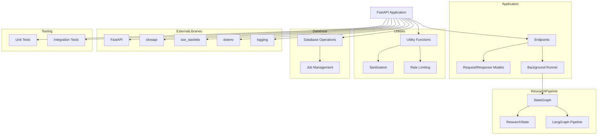

    

    <b>Automatic Architecture Diagrams from Code</b> 
    <a href="https://github.com/JashanMaan28/swark-continued">GitHub (Fork)</a> • <a href="https://github.com/swark-io/swark">Original Project</a>

## Usage Instructions

1. **Render the Diagram**: Use the links below to open it in Mermaid Live Editor, or install the [Mermaid Support](https://marketplace.visualstudio.com/items?itemName=bierner.markdown-mermaid) extension.
2. **Recommended Model**: If available for you, use `gemini` [language model](vscode://settings/swark-continued.languageModel). It can process more files and generates better diagrams.
3. **Iterate for Best Results**: Language models are non-deterministic. Generate the diagram multiple times and choose the best result.

## Generated Content
**Model**: GPT-4o - [Change Model](vscode://settings/swark-continued.languageModel)  
**Mermaid Live Editor**: [View](https://mermaid.live/view#pako:eNp9k01v2zAMhv-KoHOL3XMYkNTOp9OkdnuSh4KxWUeYTXmSvK0r-t-n2DXC5BDdHr7US5GSPmRhSpQTmVNloT2K5ygnEZbrDkNg2ra1LsBrQ4NyWlM1B-en-xWXf5z1mYqpbI0m71j0QaX4q0Pnv6XoWkMOxTZUr3lOpGZQ_Kys6agUaUeE9ktFKnO6OlzwQbDFca9brDXh2SdWmQePi1Mas5-rcUsvM2WhEqCqzxej3Y3KL17X2mt0Z4elGoLvYt5RcZoIb2ylMqCw49_1rNYqDScRiW6CStWNmhF4OIBjXW7UGBO7Fi1cF03U2hzEFggqbJD8DfP4r0dLUCf6YMFeNLYdb5s5PypXmz_QahbbKefw1XmwNfqL4e5VaTzSbxZ6UrWpqtsNP4e3EjLOm1L1EmbYx3mbmVqRx2ro_0JlrlNxf_9dzAaY9fDA4evhRz3EA8Q9zDksuNtygGUPKw5rnrYZYNNDwpUth0cOOw57Dk8cUg5ZTvJONmgb0GX41B-59Mdw8bmciFyW-AZd7XP5GZK6tgyvLtIQptbIibcd3knovMneqRg5_MLqKCdvUDv8_A8OWDmk) | [Edit](https://mermaid.live/edit#pako:eNp9k01v2zAMhv-KoHOL3XMYkNTOp9OkdnuSh4KxWUeYTXmSvK0r-t-n2DXC5BDdHr7US5GSPmRhSpQTmVNloT2K5ygnEZbrDkNg2ra1LsBrQ4NyWlM1B-en-xWXf5z1mYqpbI0m71j0QaX4q0Pnv6XoWkMOxTZUr3lOpGZQ_Kys6agUaUeE9ktFKnO6OlzwQbDFca9brDXh2SdWmQePi1Mas5-rcUsvM2WhEqCqzxej3Y3KL17X2mt0Z4elGoLvYt5RcZoIb2ylMqCw49_1rNYqDScRiW6CStWNmhF4OIBjXW7UGBO7Fi1cF03U2hzEFggqbJD8DfP4r0dLUCf6YMFeNLYdb5s5PypXmz_QahbbKefw1XmwNfqL4e5VaTzSbxZ6UrWpqtsNP4e3EjLOm1L1EmbYx3mbmVqRx2ro_0JlrlNxf_9dzAaY9fDA4evhRz3EA8Q9zDksuNtygGUPKw5rnrYZYNNDwpUth0cOOw57Dk8cUg5ZTvJONmgb0GX41B-59Mdw8bmciFyW-AZd7XP5GZK6tgyvLtIQptbIibcd3knovMneqRg5_MLqKCdvUDv8_A8OWDmk)

