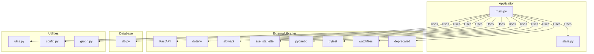

    

    <b>Automatic Architecture Diagrams from Code</b> 
    <a href="https://github.com/JashanMaan28/swark-continued">GitHub (Fork)</a> • <a href="https://github.com/swark-io/swark">Original Project</a>

## Usage Instructions

1. **Render the Diagram**: Use the links below to open it in Mermaid Live Editor, or install the [Mermaid Support](https://marketplace.visualstudio.com/items?itemName=bierner.markdown-mermaid) extension.
2. **Recommended Model**: If available for you, use `gemini` [language model](vscode://settings/swark-continued.languageModel). It can process more files and generates better diagrams.
3. **Iterate for Best Results**: Language models are non-deterministic. Generate the diagram multiple times and choose the best result.

## Generated Content
**Model**: GPT-4o - [Change Model](vscode://settings/swark-continued.languageModel)  
**Mermaid Live Editor**: [View](https://mermaid.live/view#pako:eNp90s1uwyAMAOBXiTive4AcJqVN_380aesJpskNToNECAJnXdX23cdWTUnHVN_4AFsYn1jRSGQpE2bvwFbJay5MEsK3uytk1mpVAKnGXHe-I-M1KPNoj2-dDbknIOwQjRTmT7bxJ6EzoFdq58Ap9N39EZ-Ap-x53suZc9kQmo8ejbnXzQGs6tmEe4_vobzTSIS9nSm3RwmGVNHDWUBCTz2a8wNQUZVKo-_xgku0DsPzUd55VQ4EO_DYXVxyubvfiS0preimAyveBvS3bV3zojGl2t_qhv9k-bdElgwGT-etR39OhjGNYspjGsc0iWka0zKmVUzrmDYxzWKax7QQhj2wGl2YSRlG-SQYVVijYGkimMQSWk2CXcKh1srwlbmC0L2apeRafGDQUvNyNMXv2jXtvmJpCdrj5QujUfFc) | [Edit](https://mermaid.live/edit#pako:eNp90s1uwyAMAOBXiTive4AcJqVN_380aesJpskNToNECAJnXdX23cdWTUnHVN_4AFsYn1jRSGQpE2bvwFbJay5MEsK3uytk1mpVAKnGXHe-I-M1KPNoj2-dDbknIOwQjRTmT7bxJ6EzoFdq58Ap9N39EZ-Ap-x53suZc9kQmo8ejbnXzQGs6tmEe4_vobzTSIS9nSm3RwmGVNHDWUBCTz2a8wNQUZVKo-_xgku0DsPzUd55VQ4EO_DYXVxyubvfiS0preimAyveBvS3bV3zojGl2t_qhv9k-bdElgwGT-etR39OhjGNYspjGsc0iWka0zKmVUzrmDYxzWKax7QQhj2wGl2YSRlG-SQYVVijYGkimMQSWk2CXcKh1srwlbmC0L2apeRafGDQUvNyNMXv2jXtvmJpCdrj5QujUfFc)

